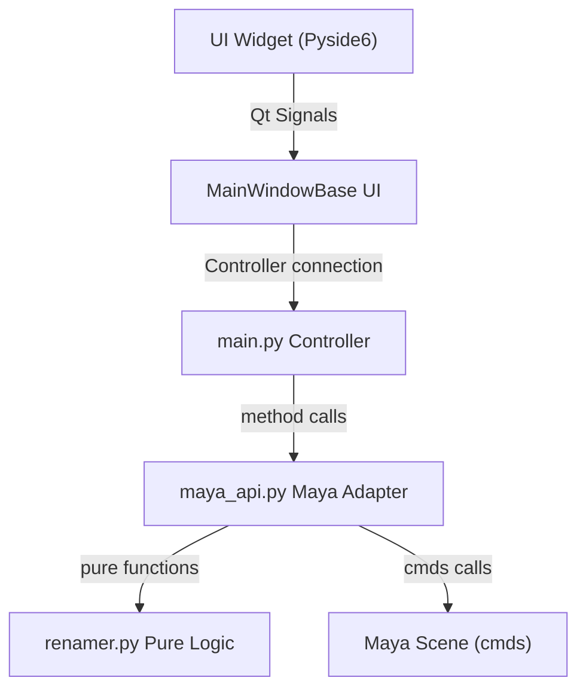

# Architecture

## Overview
Cross Renamer Tool follows a **Model-View-Controller** (MVC) pattern, with a strict separation between the renaming logic, the Maya scene operations, and the UI.


Each layer has a single responsability and communicates only with its immediate neighbour - a UI widget never calls `cmds` directly, and `renamer.py` never imports Maya.

## Layer Breakdown
### Layer 1 - Pure Logic (`core/renamer.py`)
Contains all renaming functions **pure Python functions**. No Maya dependency, no side effects - a function takes a string and returns aa string.

```python
# renamer.py - pure function, No DCC
def add_prefix(base_name: str, prefix: str) -> str:
    return f"{prefix}_{base_name}"
```
This layer is **fully unit-testable** without launching Maya. Every renaming operation - padding, search/replace, swap side, fix shape name - lives here.

### Layer 2 - Maya Adapter (`model/maya_api.py`)
Bridges the pure logic and the Maya scene. It:
- retrieves nodes from the scene via `cmds.ms`, `cmds.listRelatives`
- calls `renamer.py` for the actual name transformations
- applies the result with `cmds.rename`
- logs warning and errors

```python
# maya_api.py - calls renamer.py then cmds
def add_prefix(mode: str, prefix: str) -> dict:
    return _process_nodes(mode, lambda node: renamer.add_prefix(node, prefix))
```
The `_process_nodes` helper centralises the node retrieval + rename + log pattern - all operations use it instead of duplicating the loop.

### Layer 3 - Controller (`main.py`)
`CrossRenamerToolController` is the single entry point between the UI and the DCC Adapter. It :
- receives calls from `MainWindow`
- delegates to `maya_api.py`
- never contains business logic

```python
# main.py - delegates only, no logic
def add_prefix(self, mode: str, prefix : str)-> dict:
    return maya_api.add_prefix(mode=mode, prefix=prefix)
```

### Layer 4 - UI (`UI/maya/`)
Each features is a standalone `QWidget` that communicates via **QtSignals only** - no direct calls to the controller or DCC.

```python
# prefix_suffix_widget.py - emits a signal, nothing else
def _on_add_prefix(self) -> None:
    prefix = self.prefix.currentText()
    if prefix:
        self.request_prefix.emit(prefix)
```
`MainWindow` connects all signals to the controller methods and handles the mode selector.

## File Structure
```
📂Project_Root
 ├─📄 .env
 ├─🚫 .gitignore
 ├─📄 CHANGELOG.md
 ├─📄 install.py
 ├─📄 LICENSE
 ├─📄 mkdocs.yml
 ├─📄 pyproject.toml
 ├─📄 README.md
 ├─📄 requirements.txt
 ├─📄 .env
 └📂src
  ├─📂crossrenamertool
  │  ├─📂core
  │  │  ├─📄__init__.py
  │  │  ├─📄constants.py
  │  │  ├─📄presets.py
  │  │  └─📄renamer.py
  │  ├─📂model
  │  │  ├─📄__init__.py
  │  │  └─📄maya_api.py
  │  ├─📂resources
  │  │  ├─📂icons
  │  │  │  ├─🖼️down_arrow.svg
  │  │  │  └─🖼️up_arrow.svg
  │  │  ├─📂presets
  │  │  │  ├─📄prefixes.json
  │  │  │  └─📄suffixes.json
  │  │  └─📄README.md
  │  ├─📂ui
  │  │  ├─📂blender
  │  │  │  └─📄__init__.py
  │  │  ├─📂maya
  │  │  │  ├─📂widget
  │  │  │  │  ├─📄__init__.py
  │  │  │  │  ├─📄about_dialog.py
  │  │  │  │  ├─📄case_widget.py
  │  │  │  │  ├─📄insert_remove_widget.py
  │  │  │  │  ├─📄prefix_suffix_widget.py
  │  │  │  │  ├─📄preset_combobox.py
  │  │  │  │  ├─📄preset_dialog.py
  │  │  │  │  ├─📄rename_widget.py
  │  │  │  │  ├─📄search_replace_widget.py
  │  │  │  │  ├─📄selection_mode_widget.py
  │  │  │  │  └─📄utils_widget.py
  │  │  │  ├─📄__init__.py
  │  │  │  └─📄main_window.py 
  │  │  ├─📂styles
  │  │  │  ├─🎨default_style.qss
  │  │  │  └─📄__init__.py
  │  │  ├─📄__init__.py
  │  │  ├─📄launcher.py
  │  │  └─📄main.py
  │  └─📄__init__.py
  ├─📂tests
  │  ├─📂test_cross_renamer_tool
  │  │  ├─📄__init__.py
  │  │  └─📄test_renaming.py
  │  ├─📄__init__.py
  │  └─📄README.md
  ├─📂bin
  │  └─📄README.md
  ├─📂data
  │  └─📄README.md
  └─📂docs
     └─📂etc../
```

## Selection Modes
Node retrieval is centralised in `get_nodes(mode)` in  `maya_api.py`. three modes are supported:  
 
| Mode  | Implementation  | Notes |
| ---- | ---- | --- |
`Selected` | `cmds.ls(sl=True)`  | Current Maya selection | 
`Hierarchy` | `cmds.listRelatives(allDescendents=True, type="transform")` + joints  | Shapes excluded |
`Scene` | `cmds.ls(transforms=True)`  | Default cameras excluded via `constants.DEFAULT_CAMS` |

## Double-Pass Renaming
To avoid name conflicts when renaming multiples nodes (e.g. ith step or reordering), all batch rename operations ise a two-pass  strategy:
```
Pass 1 - rename every node to a unique temporary name
         using uuid4 -> __tmp_a3f9c21b__
Pass 2 - rename every temporary name its final name
```
This prevents Maya from auto-incrementing names when a target name already exists in the scene.

See [Explanations: Why to-Pass Renaming](../explanations/why_two_pass_renaming.md)

## Preset System
Presets are stored as JSON files in `resources/presets/` and managed by `core/presets.py`.

```
load_presets(type)  ->  reads JSON
save_presets(type)  ->  writes JSON
add_preset(type)    ->  load -> append -> save
remove_preset(type) ->  load -> remove -> save
```
The UI exposes presets via `PresetComboBox` - a custom `QComboBox` with a right-click context menu - and `PresetDialog` for full management (add, remove, reorder, rename, inline, reset to defaults).


