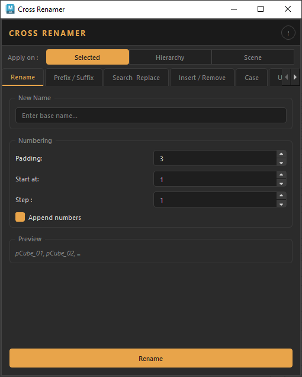

# Cross Renamer Tool

## Description
The **Cross Renamer Tool** is a production-ready renaming utility for Autodesk Maya and Blender. It covers the full range of renaming operations an artist needs on a daily basis.

!!! warning
    For now, the tool only works in Autodesk Maya

  
  
<em>Cross Renamer Tool</em>

 

<a class="md-button" href="installation/">Installation</a>
<a class="md-button" href="user_manual/">User Manual</a>
<a class="md-button" href="developer_docs/">Developer Docs</a>
<a class="md-button" href="API/">API</a>